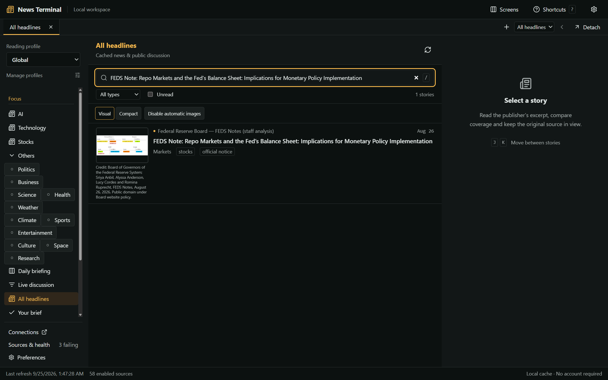

# News Terminal

A local-first Windows news and public-discussion reader. Built with Tauri 2, React/TypeScript, and SQLite. No mandatory account, hosted backend, subscription, paid scraping proxy, hosted inference, or application analytics. The system WebView2 runtime has its own background-network behavior; see the privacy notes.

The default workspace now opens to focused sections for **AI**, **Technology**, **Stocks**, and **Others** while preserving topic tabs, custom sources, profiles, saved stories, watchlists, backups and native detached windows.

## Use

Build artifacts are produced at:

- Application: `src-tauri/target/release/news-terminal.exe`
- Windows installer: `src-tauri/target/release/bundle/nsis/News Terminal_0.4.0_x64-setup.exe`

Run the installer or application. Windows WebView2 Runtime must already be installed. This package does not bundle or automatically install Microsoft runtimes; obtain WebView2 from Microsoft if it is missing. These local builds are **unsigned**: Windows may display a SmartScreen warning. No release has been published to GitHub automatically.

Open a profile, choose languages/regions/topics in **Preferences**, and use **Sources & health** to review access policies and source availability. Startup refresh is automatic. Saved stories contain the permitted feed excerpt and original URL, not an automatically scraped full article. You can read cached/saved content without refreshing.

### Reading workspace

- Left: profiles, topics, brief, saved stories, and watchlists.
- Center: searchable cached headlines with explicit reporting/discussion/official-notice labels.
- Right: publisher excerpt, original link, recommendation reasons, likely-related coverage, revision timeline, and optional summary.
- Top: independently configured tabs; reorder with the controls, detach to a real native window, and reattach. Closing a detached window reattaches its tab. Closing the main window exits the app and preserves detached layout for next startup.
- Background arrivals are staged behind **Show latest** while you read; the first successful load populates an empty reader immediately.

### Sources and coverage

The reviewed starter catalog and evidence live in [docs/sources.md](docs/sources.md) and the focused addendum in [docs/focus-source-audit.md](docs/focus-source-audit.md). The current catalog has 69 accountless feed entries, 58 enabled by default and 11 disabled candidates. Inclusion does not mean blanket rights to redistribute or transform content. English-only coverage is strongest for AI, technology, official notices, health, weather and markets; it is **not comprehensive independent global reporting**. Traditional Chinese CNA feeds broaden coverage under their personal/noncommercial terms. Set reading languages intentionally.

Bluesky, Reddit and X are **external links/search shortcuts**, not unofficial scraping integrations. Free access can change. NewsAPI's development-only free plan is not used as the production backend. Add a custom permitted HTTPS RSS/Atom feed in source settings, keeping the publisher's attribution and terms URL. News is always linked to its original source.

### Optional AI

Zero-paid mode preserves imported provider settings but blocks Gemini, Groq and any other cloud provider before execution. Local Ollama is the only summary provider path and still starts disabled, requires explicit consent, and requires source-level AI permission. Credentials are stored in Windows Credential Manager, never backups. Never configure a billed account expecting the app to enforce the provider's billing cap.

Most starter catalog sources do not grant AI-processing permission. For a custom source you have rights to process, explicitly declare AI permission. Reading permission is not AI permission. Metadata-only sources cannot be summarized. Summaries identify model/provider, generation time and excerpt-only scope. Local Ollama requires an installed model; it is not bundled.

The AI section has separate **News**, **Models**, and **Benchmarks** views. News makes no model/benchmark requests. Models provides OpenRouter catalog changes and selected Hugging Face/Qwen repository metadata; repository timestamps are not presented as model release announcements. Arena and SWE-bench retain separate metrics, licenses, provenance and last-good caches. These views require no provider keys or inference requests and do not merge incompatible scores into a universal ranking.

### Images

Opt in to automatic publisher images per profile, or load individual media in the reader. **Visual** shows permitted thumbnails; **Compact** removes them. Images disclose your IP to their publisher, use bounded static previews, retain credits, and are not cropped. Consent resets on import. No blanket publisher-host permission is assumed.

Native verification rendered exact reviewed assets from NASA, MIT News and the Federal Reserve Board. The Stocks example is a public-domain **repo-market diagram**, not an equities photograph or investment recommendation. MIT covers AI/Technology; NASA’s reviewed lunar-technologies artistic concept covers Technology. The earlier Guam restoration sample remains under Others. Image coverage is deliberately selective: most headlines do not have approved images, and feed availability changes.



### Alerts, privacy, backups

Alerts are opt-in per profile/watchlist and respect quiet hours. **The app must be running**; no hidden service or scheduled task is installed. Alerts are deduplicated and rate-limited. Windows notification settings may suppress toasts.

Export a JSON backup from settings. It contains reading preferences/history and should be kept private. Import validates before replacing data and requires confirmation. AI consent is disabled on import. Credentials are excluded. Native window placement is a separate local file, not part of the JSON backup.

Default data folder: the Tauri app-data directory for `com.newsterminal.desktop` under the current Windows user's roaming app data. For isolated testing or a deliberately chosen data location, set `NEWS_TERMINAL_DATA_DIR` before launch. This does not relocate the Windows credential store.

See [privacy](docs/privacy.md), [source policy](docs/source-policy.md), [references](docs/references.md), and [third-party notices](THIRD_PARTY_NOTICES.md).

## Develop and verify

Prerequisites: Windows, Node.js 24/npm, stable Rust MSVC toolchain, Visual Studio C++ build tools/Windows SDK, and WebView2.

```sh
npm ci
npm run tauri -- dev
```

Checks:

```sh
npm run typecheck
npm test
npx playwright install chromium
python tests/test_source_catalog.py
python scripts/check-v02-sources.py
npm run test:e2e
npx playwright test tests/e2e/model-catalog.spec.ts tests/e2e/benchmarks.spec.ts tests/e2e/v02-media.spec.ts tests/e2e/v02-connections.spec.ts --reporter=line --workers=1
npm audit
cargo fmt --manifest-path src-tauri/Cargo.toml -- --check
cargo test --manifest-path src-tauri/Cargo.toml
cargo clippy --manifest-path src-tauri/Cargo.toml --all-targets -- -D warnings
npm run tauri -- build --bundles nsis
node scripts/native-smoke.mjs
node scripts/focus-native-smoke.mjs --exe src-tauri/target/release/news-terminal.exe
python scripts/license-notices.test.py
python scripts/license-notices.py --check --strict-windows
```

The native smoke runner launches the **actual executable**, uses a fresh temporary data directory, fetches live feeds, exercises IPC/UI/native detachment/restart recovery, and records evidence under `docs/evidence/`. It enables a WebView2 debug endpoint only for its child process, then terminates that process tree. Do not expose the debug endpoint remotely. It does not change your normal app data.

Optional service checks:

```sh
cargo test --manifest-path src-tauri/Cargo.toml --lib -- --ignored --test-threads=1 --nocapture
```

These contact a public USGS feed, temporarily write/delete a unique non-secret Windows Credential Manager fixture, and bind a **fixture** Ollama endpoint on port 11434. Stop a real Ollama instance before running that fixture. They do not prove live Gemini/Groq inference or a downloaded local model.

Browser E2E uses explicitly labeled fixtures and a test-only Vite mode; fixture news and IPC injection are excluded from the production bundle. A normal browser launch correctly reports that the native runtime is required rather than inventing headlines.

## Architecture and limits

Rust owns networking, SQLite/FTS5, source scheduling, AI/credentials, notifications, and native windows. React renders the typed IPC snapshots and submits explicit intents. Workspace revision checks reject stale concurrent writes. The interface contract is [docs/IPC-CONTRACT.md](docs/IPC-CONTRACT.md).

Bounded defaults: 32 profiles, 300 sources, 100 watchlists per profile, 50 tabs per profile, 32 detached windows, 5,000 recent cached articles and up to 10,000 saved stories. Unsaved retention is 30 days; revisions retain the latest 20 stored versions. Source intervals and backoff also apply to manual refresh. Related coverage is a conservative heuristic, not verified event identity or fact checking. Source diversity is a distribution control, not an ideological score.

The original [acceptance contract](specs/001-news-terminal/spec.md) and focused [free-news contract](specs/002-focused-news/spec.md) define scope. Current measured results and qualifications are in [focused verification](docs/focus-final-verification.md). The earlier implementation handoff is historical; a successful build alone does not establish release acceptance.

## License

Project code retains the original MIT license and copyright in [LICENSE](LICENSE). Publisher content, third-party dependencies, and AI models have their own terms. Reference repositories are credited; reference-only AGPL projects were not copied into this application.
